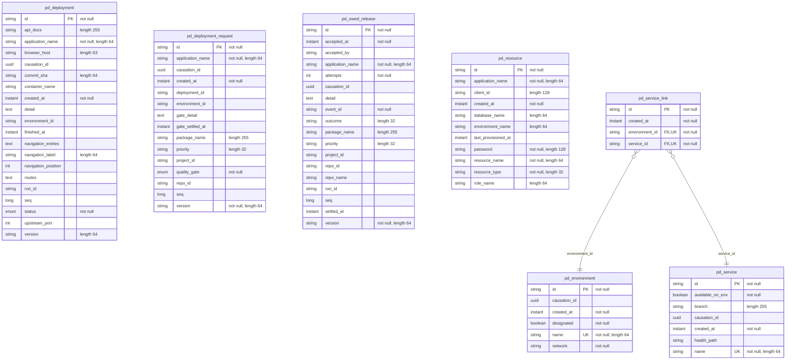

<!-- Generated by `qits database diagram` (jpa). Do not edit: the entity-diagram automation rewrites this file on every release request fold. -->
# Persistence unit `platformdeployments`

Datasource `platformdeployments` · packages `eu.wohlben.qits.deployments.environments.entity`, `eu.wohlben.qits.deployments.deployments.entity` · 7 entities

